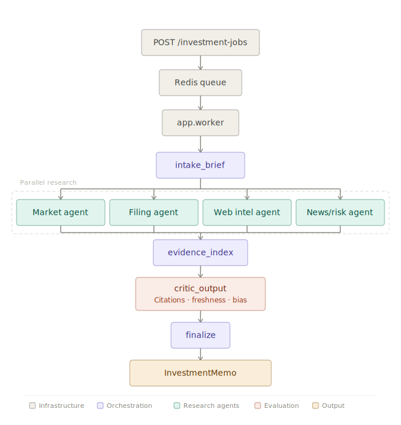

[English](README.md) | [简体中文](README_zh.md)

---

# Investment Research Multi-Agent Platform

This is a multi-agent project focused on investment research, the main deliverable is investment analysis of public companies, with the first version primarily supporting A-shares.



## Current Positioning

  - Outputs investment memos instead of generic company summaries
  - Bounded `ReAct` execution inside each agent
  - First-class agents are fixed to:
      - `market`
      - `filing`
      - `web_intel`
      - `news_risk`
      - `critic_output`
  - Uses Redis queues for async jobs and SSE for real-time progress streaming
  - Uses PostgreSQL to persist jobs, agent runs, memos, evidence documents, evidence chunks, citations, critic runs, and event records
  - Provides a Vite + React frontend for task creation, real-time traces, memo display, citation explorer, and developer JSON view

## System Architecture

Top-level orchestration is handled by `LangGraph`.

The execution flow is as follows:

1.  `POST /investment-jobs` creates an async job and pushes it to Redis.
2.  `app.worker` consumes the job and starts the graph.
3.  The graph runs sequentially:
      - `intake_brief`
      - `parallel_research`
      - `evidence_index`
      - `critic_output`
      - `finalize`
4.  The first four research agents run in parallel:
      - `Market Agent`
          - Responsible for price, yield, trading volume, volatility, and valuation snapshots
          - Accesses market data through the local `market-data-mcp` abstraction
      - `Filing Agent`
          - Responsible for disclosure/financial report discovery and structured extraction
          - Primary path is `A-share` disclosure, SEC path is secondary
      - `Web Intelligence Agent`
          - Responsible for official websites, IR pages, company positioning, product and business clues
      - `News/Risk Agent`
          - Responsible for article fetching, deduplication, clustering, event classification, event cycle determination, and impact/confidence scoring
5.  The `Critic & Output Agent` only consumes shared evidence and previous agent outputs. It checks:
      - Whether the stance is supported by evidence
      - Citation coverage
      - Freshness of evidence
      - Cross-agent consistency
      - Whether there is bias caused by duplicate news
6.  The final result is saved as an `InvestmentMemo`.

## Final Output

The final system output includes:

  - `stance`: `bullish / neutral / bearish`
  - `stance_confidence`
  - `thesis`
  - `bull_case`
  - `bear_case`
  - `key_catalysts`
  - `key_risks`
  - `valuation_view`
  - `market_snapshot`
  - `watch_items`
  - `limitations`
  - `agent_outputs`
  - `events`
  - `citations`
  - `critic_summary`

If evidence is insufficient, the critic agent will prioritize downgrading the stance to `neutral` and explicitly output limitations, rather than giving overly strong conclusions.

## Local Run

### 1\. Prepare Environment Variables

```bash
cp .env.example .env
```

Recommended to at least fill in:

  - `OPENAI_API_KEY`
  - `NEWSAPI_KEY`
  - `SEC_USER_AGENT`

In Docker mode, PostgreSQL and Redis are directly provided by `docker-compose.yml`.

### 2\. Docker One-Click Startup

```bash
docker compose up --build
```

After starting:

  - API: `http://localhost:8000`
  - Frontend: `http://localhost:3000`
  - Swagger: `http://localhost:8000/docs`

Note:

  - The current `docker-compose.yml` sets `RESET_DATABASE_ON_STARTUP=true` for the API
  - This means the database schema will be recreated upon container startup
  - The local Docker environment is better suited for demonstrations, not as a persistent production environment

### 3\. Non-Docker Method

```bash
python3 -m venv .venv
source .venv/bin/activate
pip install -r requirements.txt
npm --prefix frontend install
```

Then prepare local PostgreSQL and Redis, and run:

```bash
uvicorn app.main:app --reload
python -m app.worker
npm --prefix frontend run dev
```

In non-Docker mode, you need to provide your own PostgreSQL with `pgvector` and a Redis instance.

## Degradation and Fault Tolerance

  - Missing `OPENAI_API_KEY`
      - Planning, synthesis, and some sorting steps will degrade to heuristic behavior
  - Missing `NEWSAPI_KEY`
      - `news_risk` may return `partial`
  - A single agent failure will not directly abort the entire job
  - As long as there is enough usable evidence, the system will try its best to return `partial` instead of `failed`
  - When evidence can be matched, the system will bind citations to the conclusions
  - The critic currently outputs:
      - citation coverage
      - freshness
      - consistency
      - duplicate-event bias

## Current Limitations

  - v1 is primarily optimized for `A-shares`
  - Upstream sources relied upon for market and news data are sometimes unstable
  - Even if the main graph chain succeeds, external data source anomalies may still cause the task to ultimately result in `partial`
  - `POST /analyze` is a compatibility endpoint and does not represent the full async job semantics

## Check Commands

```bash
source .venv/bin/activate
pytest -q
python3 - <<'PY'
import app.main
import app.worker
print("imports ok")
PY
npm --prefix frontend run build
```
