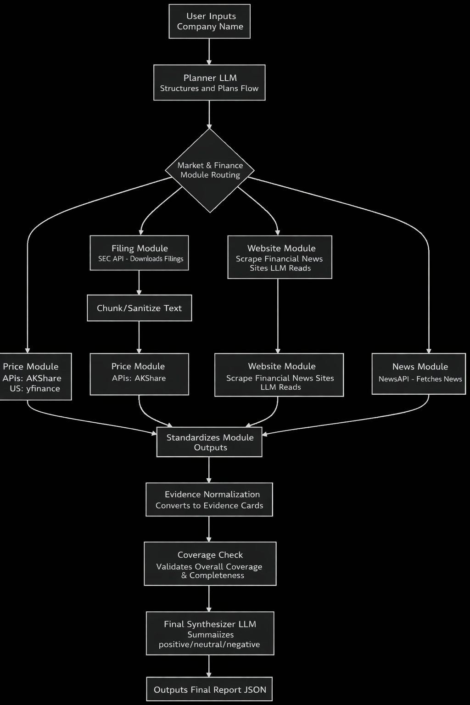

# Project Name

[English](README.md) | [简体中文](README_zh.md)

---

# Deep Research Agent (LangGraph + LangChain)

A readable MVP for a **company recent-status research agent** powered by **LangGraph** for orchestration and **LangChain** for model I/O, tool-style adapters, and RAG.

## What it does

Input:

```json
{
  "company_name": "Apple"
}
```

Output:

```json
{
  "company_name": "Apple",
  "overall_sentiment": "positive",
  "summary": "...",
  "key_findings": ["..."],
  "risks": ["..."],
  "limitations": ["..."],
  "module_results": {
    "price": {},
    "filing": {},
    "website": {},
    "news": {}
  },
  "evidence": []
}
```

## Design goals

- LangGraph as the main workflow engine
- LangChain for LLM calls, structured output, and filing RAG
- Strict Pydantic validation for planner output and final output
- Graceful fallback for:
  - non-public companies
  - ticker resolution failure
  - missing SEC filings
  - website discovery/crawl failure
  - empty news
- Mockable adapters for each module
- Readable MVP, easy to extend

## Workflow



1. **Planner node**
   - First model call
   - Produces structured JSON plan:
     - `company_name`
     - `is_public`
     - `market`
     - `selected_modules`
     - `rationale`
     - `confidence`

2. **Program-side routing**
   - `price`
   - `filing`
   - `website`
   - `news`

3. **Evidence normalization**
   - Every module emits standardized evidence cards

4. **Coverage check**
   - checks module count
   - checks recent evidence
   - checks evidence sufficiency
   - records warnings

5. **Final synthesizer**
   - Last model call
   - Uses structured evidence instead of raw crawl dumps
   - Produces validated final JSON report
  
## Install

```bash
python -m venv .venv
source .venv/bin/activate
pip install -r requirements.txt
```

## Run API

```bash
uvicorn app.main:app --reload
```

Open:

- `http://127.0.0.1:8000/docs`

## API example

### Request

```bash
curl -X POST http://127.0.0.1:8000/analyze   -H "Content-Type: application/json"   -d '{"company_name":"NVIDIA"}'
```

### Response shape

```json
{
  "company_name": "NVIDIA",
  "overall_sentiment": "positive",
  "summary": "....",
  "key_findings": ["..."],
  "risks": ["..."],
  "limitations": ["..."],
  "module_results": {
    "price": {
      "module": "price",
      "applicable": true,
      "summary": "...",
      "metrics": {},
      "rag_answers": {},
      "key_points": [],
      "event_timeline": [],
      "evidence": [],
      "status": "success",
      "reason": null,
      "warning": null,
      "error": null
    }
  },
  "evidence": [
    {
      "module": "news",
      "source_type": "news_article",
      "title": "...",
      "date": "2026-03-18T10:00:00Z",
      "snippet": "...",
      "url": "https://..."
    }
  ]
}
```

## Notes on adapters

Each module is intentionally adapter-driven so you can replace the data source later:

- `YFinancePriceAdapter`
- `AksharePriceAdapter`
- `SecEdgarAdapter`
- `DefaultWebsiteDiscoveryAdapter`
- `RequestsWebsiteCrawler`
- `NewsApiAdapter`

For testing, inject mock adapters into:

- `run_price_module(...)`
- `run_filing_module(...)`
- `run_website_module(...)`
- `run_news_module(...)`

## Current MVP trade-offs

- The graph is intentionally linear for readability.
  - Nodes still perform program-side routing and can skip themselves gracefully.
  - If you want parallel fan-out later, replace the fixed chain with `Send`-based branching.
- Website discovery uses a best-effort public search fallback.
- Filing retrieval currently prioritizes recent SEC forms and extracts text from the filing HTML page directly.
- Final synthesis is conservative when evidence coverage is weak.

