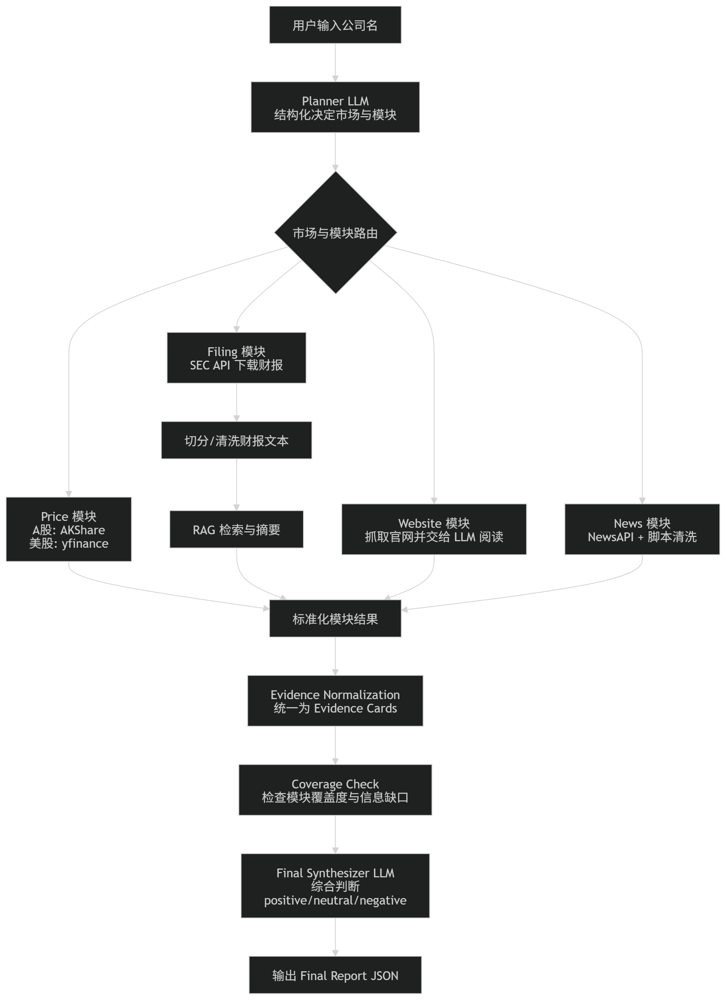

[English](README.md) | [简体中文](README_zh.md)

---

# 基于LangGraph + LangChain的深度调研智能Agent

这是一个易于阅读的**企业近况调研智能体** MVP。它使用 **LangGraph** 进行任务流编排，并利用 **LangChain** 处理模型 I/O、工具适配器以及 RAG 逻辑。

## 功能逻辑

**输入示例：**
```json
{
  "company_name": "Apple"
}

```

**输出示例：**

```json
{
  "company_name": "Apple",
  "overall_sentiment": "positive",
  "summary": "...",
  "key_findings": ["..."],
  "risks": ["..."],
  "limitations": ["..."],
  "module_results": {
    "price": {},
    "filing": {},
    "website": {},
    "news": {}
  },
  "evidence": []
}

```

## 设计目标

* **LangGraph 编排**：将其作为核心工作流引擎。
* **LangChain 集成**：负责 LLM 调用、结构化输出生成以及财报 RAG 检索。
* **严格验证**：使用 Pydantic 对 Planner 输出和最终报告进行严格验证。
* **Fallback**：针对非上市公司、代码识别失败、缺失财报、官网爬取失败或新闻为空等情况均有容错处理。
* **模块化适配器**：各模块适配器均可 Mock（模拟数据），方便扩展和测试。
* **高可读性**：代码结构清晰，易于根据业务需求进行二次开发。

## Workflow



1. **规划节点**：进行首次模型调用，产出包含公司基本信息和待执行模块的结构化 JSON 计划。
2. **程序端路由**：根据计划分发任务至 `price`、`filing`、`website` 和 `news` 模块。
3. **证据标准化**：每个模块都会产生标准化的证据卡片 (Evidence Cards)。
4. **覆盖度检查**：检查模块运行数量、证据时效性及充分性，记录潜在的警告信息。
5. **最终合成**：最后一次模型调用，基于结构化证据（而非原始网页抓取内容）产出经过验证的最终 JSON 报告。

## 安装与运行

### 1. 安装环境

```bash
python -m venv .venv
source .venv/bin/activate  # Windows 用户请使用 .venv\Scripts\activate
pip install -r requirements.txt

```

### 2. 启动项目

你可以直接运行我们配置好的脚本一键启动：

* **Windows 用户**：双击 `run.bat`。
* **Mac/Linux 用户**：在终端执行 `sh run.sh`。

或者手动启动 API 服务：

```bash
uvicorn app.main:app --reload

```

启动后在浏览器打开 `http://127.0.0.1:8000/docs` 即可进入 Swagger 交互式文档页面进行测试。

## 模块适配器说明

每个模块都采用适配器驱动模式，方便后期更换数据源：

* **股价**：`YFinancePriceAdapter`。
* **财报**：`SecEdgarAdapter`。
* **官网爬虫**：`RequestsWebsiteCrawler`。
* **新闻**：`NewsApiAdapter`。

## 当前 MVP 的局限与折衷

* **线性图结构**：为了提高逻辑可读性，Graph 目前是线性排列的。如果需要并行执行，建议改为基于 `Send` 的分支结构。
* **官网发现**：采用尽力而为的公开搜索回退策略。
* **财报提取**：优先处理最新的 SEC 表单并直接解析 HTML 文本内容。
* **综合评估**：在证据覆盖不足时，最终合成器会倾向于给出保守的评估结果。
```

```
